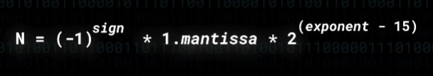

# Floating point representation

IEEE 754 Floating point number specification

## Notes

- **Calculation**

## References:
- Visualisation: https://zohnannor.github.io/float-calculator/
- Low Level JavaScript video: https://youtu.be/wPBjd-vb9eI
- Floating Point Arithmetic: https://en.wikipedia.org/wiki/Floatin...
- 16 Bit Floats: https://en.wikipedia.org/wiki/Half-pr...
- IEEE 754 Spec: https://ieeexplore.ieee.org/document/...
- Fabien Sanglard's awesome blog on the subject: http://fabiensanglard.net/floating_po...
- Denormalised Numbers: https://en.wikipedia.org/wiki/Denorma...